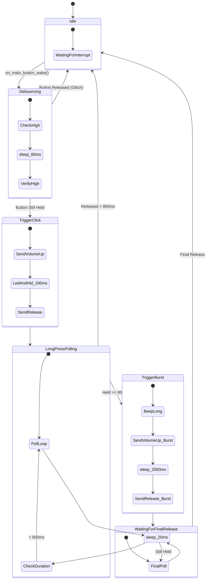

# Gesture Engine Logic

This diagram illustrates the state transitions and timing logic for the `GestureEngine` (main button handling).

## Timing Constants
| Parameter | Value | Description |
| :--- | :--- | :--- |
| `kDebounceMs` | 60ms | Initial noise filtering |
| `kLongPressMs` | 800ms | Threshold for Burst mode |
| `kBurstHoldMs` | 2000ms | Duration of the Volume Up hold in Burst mode |
| `kPollMs` | 20ms | Interval for checking button state during hold |
