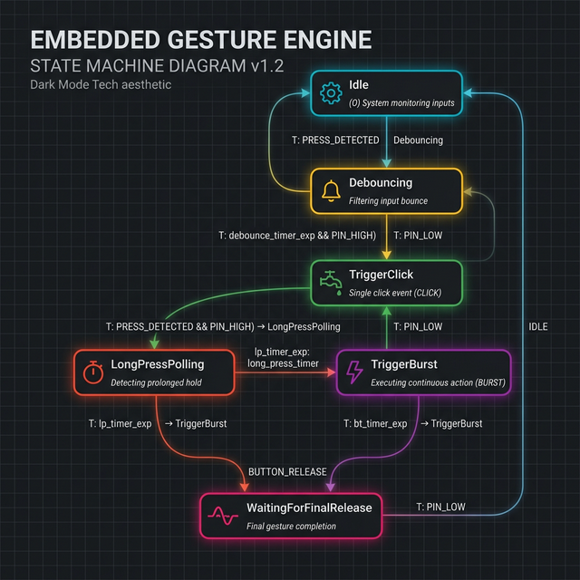

# Gesture Engine Logic

This diagram illustrates the state transitions and timing logic for the `GestureEngine` (main button handling).



## Technical Source (Mermaid)
stateDiagram-v2
    [*] --> Idle
    
    state Idle {
        [*] --> WaitingForInterrupt
    }
    
    Idle --> Debouncing : on_wake
    
    state Debouncing {
        [*] --> CheckHigh
        CheckHigh --> Sleep60ms
        Sleep60ms --> VerifyHigh
    }
    
    Debouncing --> Idle : GlitchDetected
    Debouncing --> TriggerClick : ButtonHeld
    
    state TriggerClick {
        [*] --> SendVolumeUp
        SendVolumeUp --> LedAndHidDelay
        LedAndHidDelay --> SendRelease
    }
    
    TriggerClick --> LongPressPolling
    
    state LongPressPolling {
        [*] --> PollLoop
        PollLoop --> LPSleep20ms
        LPSleep20ms --> CheckDuration
        CheckDuration --> PollLoop : Under800ms
    }
    
    LongPressPolling --> Idle : ShortPressComplete
    LongPressPolling --> TriggerBurst : HeldLong
    
    state TriggerBurst {
        [*] --> BeepLong
        BeepLong --> SendBurstUp
        SendBurstUp --> Sleep2000ms
        Sleep2000ms --> SendBurstRelease
    }
    
    TriggerBurst --> WaitingForFinalRelease
    
    state WaitingForFinalRelease {
        [*] --> FinalPoll
        FinalPoll --> FRSleep20ms
        FRSleep20ms --> FinalPoll : StillHeld
    }
    
    WaitingForFinalRelease --> Idle : Released
```

## Timing Constants
| Parameter | Value | Description |
| :--- | :--- | :--- |
| `kDebounceMs` | 60ms | Initial noise filtering |
| `kLongPressMs` | 800ms | Threshold for Burst mode |
| `kBurstHoldMs` | 2000ms | Duration of the Volume Up hold in Burst mode |
| `kPollMs` | 20ms | Interval for checking button state during hold |
